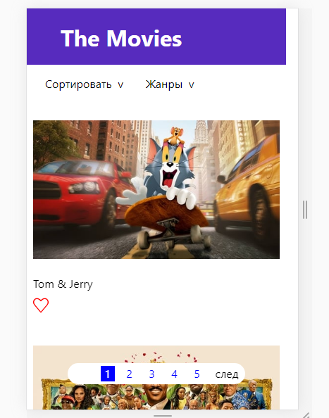
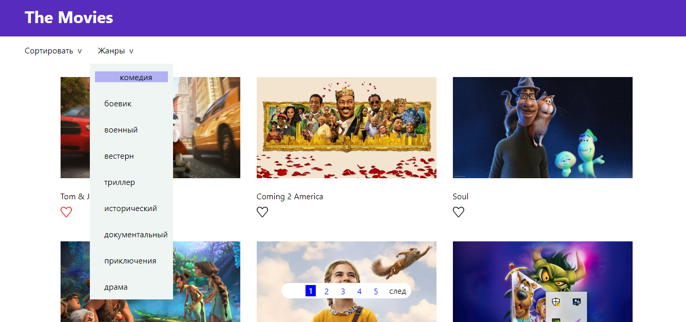

## О проекте:  

Этот приложение с информацией о фильмах. В нем предусмотрены различные сортировки(по популярности, по дате и жанрам), возможность добавления фильмов в избранное.
Проект взаимодействует с сервером используя REST API.  

## В проекте использованы следующие технологии:  

JS
React.js(React hooks)  
React-router-dom
REST API

## Для запуска проекта выполнить следующие команды:  

Для клонирование репозитория: git clone https://github.com/ortkyu/movies.io.git  

Инициализация проекты:  

npm install 
или 
yarn install  

Запуск проекта:  

npm start 
или 
yarn start  

Приложение запускается на http://localhost:3000  

В браузере переходим по адресу:  http://localhost:3000  

